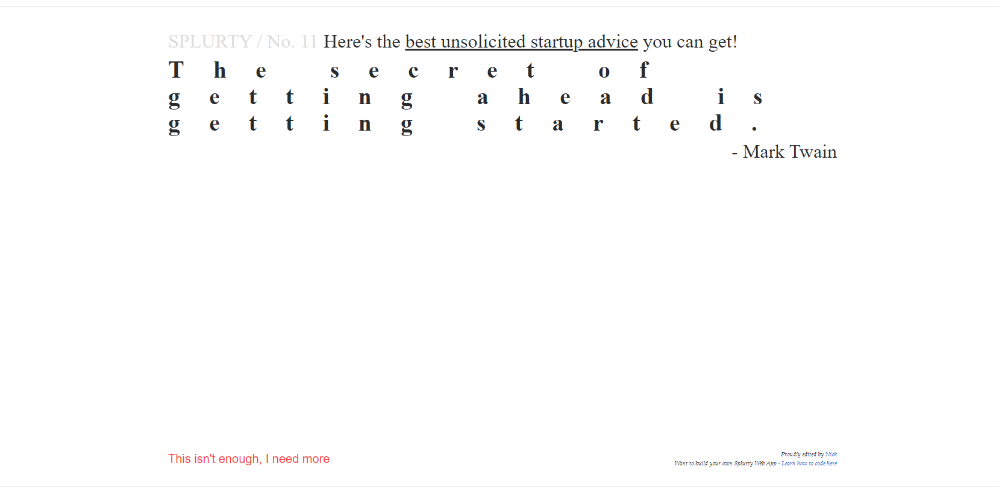

# OVERVIEW

*  Database-powered quote generator with a mobile-first design.

# HOME PAGE

* Users will be sent to the home page.  A single quote is diplayed on the home page and each time the page is refreshed a quote is pulled at random to be displayed.  The user 
  can refresh the page by clicking on the "you know you need to code" red circle or the "This isn't enough, I need more" link.

* To add a quote, the user will click on contribute, which will provide a form including a saying and author to be added.  Once a quote is added, it will be included in the 
  database to be pulled at random for display on the homepage.

# ABOUT PAGE

* The user can click on about to be taken to a new page that provides information about Splurty.

# FOOTER

* The user will find a link to the portfolio of the individual responsible for editing the  Splurty app along with a link to an educational platform that teaches how to code.